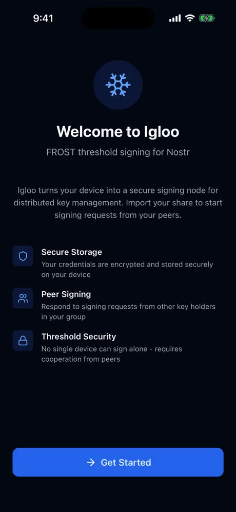
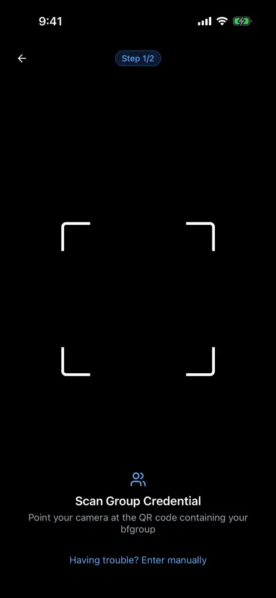
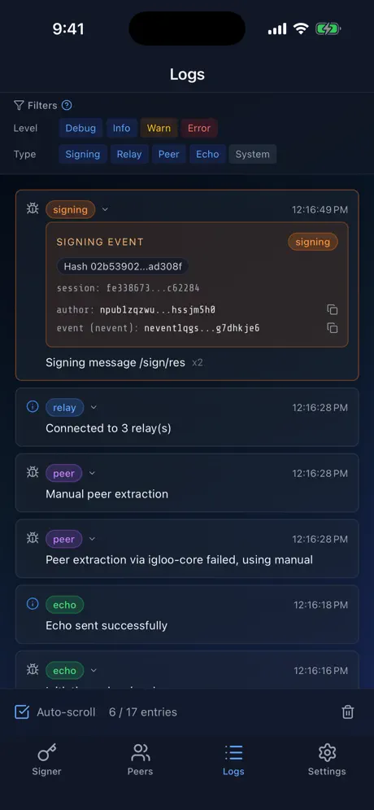
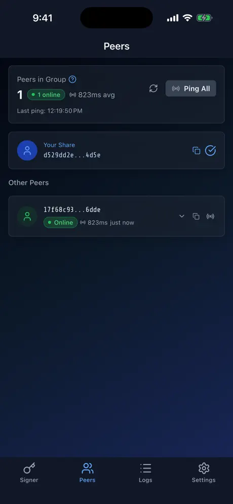

# Igloo Signer for iOS

Igloo is live on the iOS App Store: [Download Igloo Signer](https://apps.apple.com/us/app/igloo-signer/id6758069194).

## What Igloo Is

Igloo is the iPhone companion app for [FROSTR](https://frostr.org) threshold signing on Nostr. It lets your phone operate as a signer node in a threshold group, with onboarding for credential import, peer visibility, signer status, and session/log inspection while keeping credentials stored on-device with platform secure storage.

## Screenshots

<p>
  
  
  
  
</p>

## Links

- App Store: <https://apps.apple.com/us/app/igloo-signer/id6758069194>
- Website: <https://frostr.org>
- Apps: <https://frostr.org/apps>
- Privacy Policy: <https://frostr.org/privacy>
- Support: <https://github.com/FROSTR-ORG/igloo-ios/issues>

## App icon

- Use the solid-background Frostr logo for iOS app icons.
- Do not pre-round or mask the asset; iOS applies icon masking.
- Keep `assets/images/icon.png` and `ios/Igloo/Images.xcassets/AppIcon.appiconset/App-Icon-1024x1024@1x.png` in sync when updating icons.

## Run Locally

```bash
bun install
bun ios
```

If you prefer the Expo dev server flow, run `bun start` and press `i` for the iOS simulator.

## Scope

This repository is the iOS app for Igloo Signer. Some cross-platform React Native code remains in the tree, but the public shipped app and the primary supported target here are iPhone and iPad.
